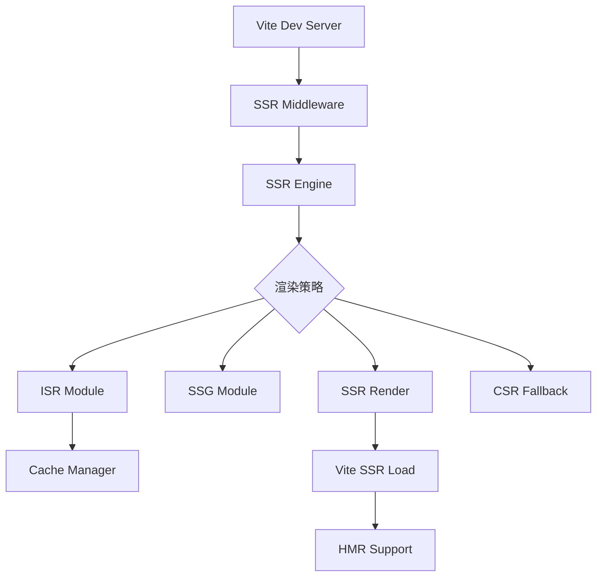

# @novel-isr/engine

> 企业级增量静态再生引擎 - 自动降级链 ISR → SSR → CSR

[](https://badge.fury.io/js/@novel-isr%2Fengine)
[](http://www.typescriptlang.org/)
[](https://vitejs.dev/)
[](https://opensource.org/licenses/MIT)

## ✨ 特性

- 🚀 **自动降级链** - ISR → SSR → CSR，对用户透明
- ⚡ **Vite 驱动** - 极速开发体验，热模块替换支持
- 📦 **零配置启动** - 开箱即用，支持自定义配置
- 🎯 **TypeScript 优先** - 完整类型安全，企业级代码质量
- 🔧 **智能路由** - 基于配置的渲染模式选择
- 📊 **内置监控** - 实时统计和性能指标
- 🌐 **SEO 优化** - 自动生成 robots.txt 和 sitemap.xml
- 🔥 **现代化架构** - ES 模块，Tree-shaking，代码分割

## 🚀 快速开始

### ⚡ 10 秒启动（零配置）

```bash
# 1. 安装
npm install @novel-isr/engine

# 2. 启动（无需任何配置）
npx novel-isr dev
```

🎉 **完成！** 访问 http://localhost:3000

### 📝 自定义配置（可选）

生成配置文件模板：

```bash
npx novel-isr init  # 自动生成 ssr.config.js 或 ssr.config.ts
```

或手动创建 `ssr.config.js`：

```javascript
// ssr.config.js
export default {
  mode: 'isr', // 默认渲染模式
  server: { port: 3000 }, // 服务器配置
  routes: {
    '/': 'ssg', // 首页静态生成
    '/posts/*': 'isr', // 动态页面 ISR
  },
  seo: {
    enabled: true,
    baseUrl: 'https://your-domain.com',
  },
};
```

### 🔧 TypeScript 支持

```typescript
// ssr.config.ts
import type { NovelSSRConfig } from '@novel-ssr/engine';

export default {
  mode: 'isr',
  routes: {
    '/': 'ssg',
    '/posts/*': 'isr',
  },
} satisfies NovelSSRConfig;
```

### 📋 所有命令

```bash
npx novel-ssr dev      # 开发模式（零配置启动）
npx novel-ssr init     # 生成配置文件模板
npx novel-ssr build    # 构建生产版本
npx novel-ssr start    # 启动生产服务器
npx novel-ssr deploy   # 构建并生成部署资源
npx novel-ssr stats    # 查看统计信息
```

### 🔌 内置功能

- ✅ **Vite + React**: 已内置，无需额外安装
- ✅ **TypeScript**: 完整类型支持
- ✅ **热重载 (HMR)**: 开发模式自动启用
- ✅ **自动构建**: 生产优化构建
- ✅ **SEO 优化**: 自动 sitemap 和 robots.txt

## 📖 API 文档

### createNovelEngine(config)

创建 Novel SSR 引擎实例。

```typescript
import { createNovelEngine, type NovelSSRConfig } from '@novel-ssr/engine';

const config: NovelSSRConfig = {
  // 渲染模式 - 'isr' | 'ssg'
  mode: 'isr',

  // 服务器配置
  server: {
    port: 3000,
    host: 'localhost',
  },

  // ISR 配置
  isr: {
    revalidate: 3600, // 重新生成间隔(秒)
    backgroundRevalidation: true,
  },

  // 缓存配置
  cache: {
    strategy: 'memory', // 'memory' | 'redis' | 'filesystem'
    ttl: 3600,
  },

  // SEO 配置
  seo: {
    enabled: true,
    generateSitemap: true,
    generateRobots: true,
    baseUrl: 'https://example.com',
  },

  // 路由配置
  routes: {
    '/': 'isr',
    '/about': 'ssg',
    '/blog/*': 'isr',
  },

  // 开发配置
  dev: {
    verbose: true,
    hmr: true, // Vite HMR 支持
  },
};

const engine = createNovelEngine(config);
```

### 引擎方法

#### engine.dev()

启动开发服务器，启用所有功能和调试模式。

```javascript
await engine.dev();
```

#### engine.build()

构建生产版本，进行优化和预渲染。

```javascript
await engine.build();
```

#### engine.start()

启动生产服务器。

```javascript
await engine.start();
```

#### engine.deploy()

构建并生成部署资源。

```javascript
await engine.deploy();
```

#### engine.getStats()

获取引擎运行统计信息。

```javascript
const stats = engine.getStats();
console.log(stats);
```

## 🔧 配置

### 配置文件

使用 CLI 生成配置文件模板：

```bash
npx novel-ssr init  # 自动生成配置文件
```

或在项目根目录手动创建 `ssr.config.js`:

```javascript
export default {
  mode: 'isr',
  server: {
    port: 3000,
    host: '0.0.0.0',
  },
  isr: {
    revalidate: 3600,
    backgroundRevalidation: true,
  },
  cache: {
    strategy: 'memory',
    ttl: 3600,
  },
  seo: {
    enabled: true,
    baseUrl: 'https://example.com',
  },
  routes: {
    '/': 'isr',
    '/about': 'ssg',
    '/api/*': 'ssr',
    '/blog/*': 'isr',
  },
};
```

### 环境变量

```bash
NODE_ENV=production    # 生产模式
SSR_PORT=3000         # 服务器端口
SSR_HOST=0.0.0.0      # 服务器主机
SSR_CACHE=redis       # 缓存策略
```

## 🏗️ 架构设计

### 自动降级链

Novel SSR 引擎实现了智能的降级策略：

1. **ISR (增量静态再生)** - 优先模式，最佳性能
2. **SSR (服务端渲染)** - ISR 失败时的降级
3. **CSR (客户端渲染)** - 最终降级，确保可用性

### TypeScript 模块架构

```
@novel-ssr/engine (TypeScript + Vite)
├── config/              # 配置系统
│   ├── EnterpriseConfig.ts
│   └── SSRConfig.ts
├── engines/             # 渲染引擎
│   ├── SSREngine.ts     # 核心引擎 (Vite 集成)
│   ├── SSRFactory.ts    # 工厂模式
│   └── RenderMode.ts    # 渲染模式
├── modules/             # 功能模块
│   ├── ISRModule.ts     # ISR 实现
│   ├── SSGModule.ts     # SSG 实现
│   ├── SEOModule.ts     # SEO 优化
│   └── CSRFallback.ts   # CSR 降级
├── utils/               # 工具类
│   ├── CacheManager.ts  # 缓存管理
│   ├── Logger.ts        # 日志系统
│   ├── RouteManager.ts  # 路由管理
│   └── ViteSSRPlugin.ts # Vite 插件
├── cli/                 # 命令行工具
│   └── cli.ts           # TypeScript CLI
├── types.ts             # 类型定义
├── index.ts             # 主入口
├── vite.config.ts       # Vite 配置
└── tsconfig.json        # TypeScript 配置
```

### Vite 集成架构



## 🚀 部署

### Docker 部署

```dockerfile
FROM node:18-alpine
WORKDIR /app
COPY package*.json ./
RUN npm install
COPY . .
RUN npx novel-ssr build
EXPOSE 3000
CMD ["npx", "novel-ssr", "start"]
```

### Vercel 部署

```json
{
  "version": 2,
  "builds": [
    {
      "src": "package.json",
      "use": "@vercel/node"
    }
  ],
  "routes": [
    {
      "src": "/(.*)",
      "dest": "/api/ssr"
    }
  ]
}
```

## 🔍 监控与调试

### 内置监控端点

```bash
# 健康检查
curl http://localhost:3000/health

# 运行统计
curl http://localhost:3000/ssr-stats
```

### 调试模式

```javascript
const engine = createNovelEngine({
  dev: {
    verbose: true, // 启用详细日志
    hmr: true, // 启用热模块替换
  },
});
```

## 📝 示例

### React + TypeScript + Vite 项目集成

```typescript
// ssr.config.ts
import type { NovelSSRConfig } from '@novel-ssr/engine';

export default {
  mode: 'isr',
  server: { port: 3000 },
  routes: {
    '/': 'isr',
    '/about': 'ssg',
    '/posts/*': 'isr',
  },
  dev: {
    hmr: true,
    verbose: true,
  },
} satisfies NovelSSRConfig;

// vite.config.ts
import { defineConfig } from 'vite';
import react from '@vitejs/plugin-react-swc';
import { createViteSSRPlugin } from '@novel-isr/engine';
import config from './ssr.config';

export default defineConfig({
  plugins: [react(), createViteSSRPlugin({ config })],
});

// server.ts
import { createNovelEngine } from '@novel-ssr/engine';
import config from './ssr.config';

const engine = createNovelEngine(config);
await engine.start();
```

### Express 中间件集成

```typescript
// server.ts
import express from 'express';
import { createViteDevMiddleware, createNovelEngine } from '@novel-ssr/engine';

const app = express();
const engine = createNovelEngine({
  mode: 'isr',
  dev: { hmr: true },
});

await engine.initialize();

// 添加 SSR 中间件
app.use('*', createViteDevMiddleware(engine));

app.listen(3000, () => {
  console.log('服务器启动在 http://localhost:3000');
});
```

### 入口文件示例

```typescript
// src/entry-server.tsx
import React from 'react';
import { renderToString } from 'react-dom/server';
import { StaticRouter } from 'react-router-dom/server';
import App from './App';

export function render(url: string, context?: any) {
  const html = renderToString(
    <React.StrictMode>
      <StaticRouter location={url}>
        <App />
      </StaticRouter>
    </React.StrictMode>
  );

  return {
    html: `<!DOCTYPE html>
<html>
  <head>
    <meta charset="UTF-8" />
    <meta name="viewport" content="width=device-width, initial-scale=1.0" />
    <title>Novel SSR App</title>
  </head>
  <body>
    <div id="root">${html}</div>
    <script type="module" src="/src/entry-client.tsx"></script>
  </body>
</html>`,
    statusCode: 200
  };
}
```

## 🤝 贡献

欢迎提交 Issue 和 Pull Request！

## 📄 许可证

MIT License

## 🔗 相关链接

- [GitHub 仓库](https://github.com/novel-team/isr-engine)
- [文档网站](https://isr-engine.novel.dev)
- [问题反馈](https://github.com/novel-team/isr-engine/issues)
